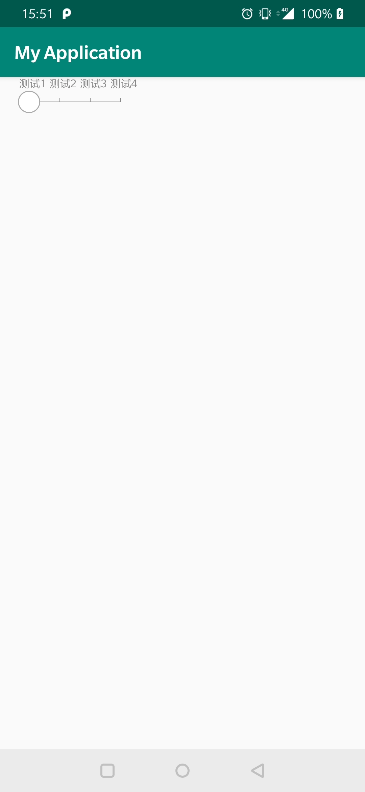

# RulerView
仿今日头条修改字体的控件

## 集成方法
```
allprojects {
	repositories {
			...
			maven { url 'https://jitpack.io' }
	}
}
```

```
dependencies {
	 implementation 'com.github.ZhengJeff:RulerView:0.0.1'
}
```
## 使用方法
1. 
```
<com.jeff.ruler.RulerView  
  android:id="@+id/ruler_view"  
  android:layout_width="wrap_content"  
  android:layout_height="wrap_content"  
  app:buttonImageSrc="@drawable/shape_circle" />
```
2. 设置绘制元素`rulerView.setData(mData);`
## 属性
|属性名|类型|说明|
|:--|:--|:--|
|buttonImageSrc|reference|设置游标图标|
|rulerLineColor|color|绘制线条颜色|
|rulerVerticalHeight|integer|竖直线条的高度|
## 公开api
`setData(List<RulerData> data)`设置展示属性

